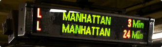

### ASCII Art 

The Goal  
In stations and airports you often see this type of screen:  

  
Have you ever asked yourself how it might be possible to simulate this display on a good old terminal? We have: with ASCII art!  

Rules

ASCII art allows you to represent forms by using characters. To be precise, in our case, these forms are words. For example, the word "MANHATTAN" could be displayed as follows in ASCII art:
```
# #  #  ### # #  #  ### ###  #  ###
### # # # # # # # #  #   #  # # # #
### ### # # ### ###  #   #  ### # #
# # # # # # # # # #  #   #  # # # #
# # # # # # # # # #  #   #  # # # #
``` 

Your mission is to write a program that can display a line of text in ASCII art in a style you are given as input.
